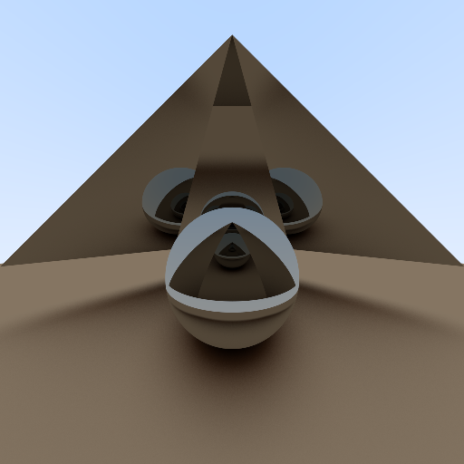

Ray Tracing
===

**Warning.** This is not production ready at all. The code is written while I am learning ray tracing.


```bash
# Execute program
go run .

# Run tests
go test ./...
```

## Showcase

### Six triangles and a sphere (Metalic)



- Time spent to render: 3 minutes
- Anti-aliasing level: 1024